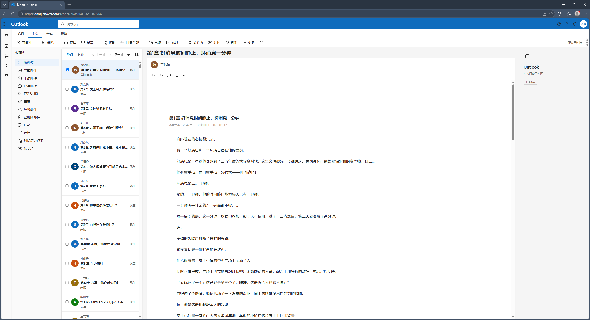

# 番茄 Mail 阅读工作区

> 当前状态：M3.0/M3.1 章节工作流已完成本地实现与自动验证，M4.2 Chrome 核心流程与 M4.3 核心手工检查已由用户确认；个人 M4.4 候选包已生成但实际安装冒烟尚待用户完成，真实性能未量化但经接受不再阻塞阶段交接。

个人使用的 Chrome/Edge Manifest V3 原型扩展。它只把番茄小说官方阅读页包进一个截图级七区 Outlook 阅读工作区，不连接真实邮箱，也不建立服务器。

这是独立个人项目，不是微软或番茄小说官方产品。

## 支持范围

阅读工作区仅匹配：

https://fanqienovel.com/reader/*

同步失败后只有用户明确点击“打开作品页同步”才会打开同一本书的官方作品页，作品页采集脚本仅匹配：

https://fanqienovel.com/page/*

正文仍由番茄原生 .muye-reader-box 节点显示。扩展不会提取正文 textContent，不会在 Shadow DOM 中重建正文，不调用未公开接口，不批量抓取或缓存小说正文。

## 给普通用户的安装方法

1. 在仓库中点击最新个人候选包：[fanqie-mail-0.1.0-personal-20260831-3.zip](dist/fanqie-mail-0.1.0-personal-20260831-3.zip)，进入 GitHub 文件页后选择“Download raw file”下载 ZIP。
2. 将 ZIP 解压到一个固定目录，确认解压目录根部直接有 `manifest.json`。ZIP 不能直接加载；加载后不要移动、删除或重命名这个目录。
3. 打开 Chrome 的 `chrome://extensions`，或 Edge 的 `edge://extensions`，打开“开发者模式”，点击“加载已解压的扩展”，选择上一步的目录。
4. 从番茄作品页点击“开始阅读”进入真实阅读页；也可使用已验证示例 `https://fanqienovel.com/reader/7504850255494529561`。说明：`*` 只是扩展的匹配范围，不是需要输入的完整地址。

已有 `D:\番茄` 安装无需卸载，也不要清除数据。若要测试下载的候选包，先停用旧扩展，避免两个实例同时注入；不同加载目录可能得到不同扩展 ID 和独立存储，不承诺自动迁移。本项目没有构建步骤和运行时依赖。

## 首次使用：同步章节目录

1. 初次启用时，中间列表只显示当前章节。
2. 点击功能区“更多”右侧的信封图标（提示为“同步邮件”）。
3. 按页面提示点击番茄原生“目录”。
4. 等待提示显示已读取的章节数量 `N`。
5. 关闭番茄原生目录，回到邮箱界面查看完整章节列表。

## 产品与技术基线

- [产品需求文档](docs/product/fanqie-mail-prd.md)
- [技术规格](docs/superpowers/specs/2026-08-28-fanqie-mail-workspace-design.md)
- [番茄与 Outlook 走查及 review](docs/product/2026-08-29-fanqie-outlook-research-review.md)
- [M2 截图级复刻实施计划](docs/superpowers/plans/2026-08-30-fanqie-outlook-screenshot-replica.md)
- [M3 章节工作流实施计划](docs/superpowers/plans/2026-08-30-fanqie-m3-chapter-workflow.md)
- [M3.0 原生阅读页目录同步规格](docs/superpowers/specs/2026-08-30-fanqie-native-catalog-sync-design.md)
- [M3.0 原生阅读页目录同步计划](docs/superpowers/plans/2026-08-30-fanqie-native-catalog-sync.md)
- [M3 收尾验收表与 M4 交接](docs/product/2026-08-31-fanqie-m3-closeout-acceptance.md)
- [M4.1 兼容与发布验收基线计划](docs/superpowers/plans/2026-08-31-m4-compatibility-release.md)
- [个人候选包安装说明](docs/release/fanqie-mail-personal-install.md)
- [M4 候选包验收摘要](docs/release/fanqie-mail-m4-acceptance-summary.md)

M2 使用 Microsoft Fluent UI System Icons 的本地 20px regular 路径，固定来源提交为
`4d685f77b2cb8f3f412a74ec8d920c8c91149528`，许可与来源记录在
`third_party/fluentui-system-icons/LICENSE` 和 `NOTICE.md`。

## 使用方式

- 顶部功能区提供 Outlook 截图中的命令组；“上一封”和“下一封”位于邮件列表标题行，并代理番茄阅读器的“上一章”和“下一章”原生按钮。
- 同步入口位于功能区“更多”右侧的信封图标，鼠标悬停提示为“同步邮件”。点击后按提示直接打开番茄原生“目录”，关闭原生目录后返回邮箱并读取真实章节列表；失败后只有用户明确点击“打开作品页同步”才进入作品页回退，不自动创建隐藏 iframe。
- 目录成功后显示实际章节数，已读状态使用一次批量本地读取；目录同步不移动、克隆或脚本点击番茄控件。当前文档的 `data-fqmail-perf` 仅提供最近三条非敏感目录/搜索/筛选计时样本（含 DOM 提交耗时和跨绘制帧机会估计），不持久化。
- 从完整目录选择章节时，跳转前等待进度和已读状态写入，并使用经校验的同源阅读链接整页导航；完整目录元数据由后台按当前标签页隔离保存在 `storage.session`，新阅读页可重复恢复同一份经校验的章节元数据。章节身份不匹配时不显示旧目录；同一本书的新一轮成功同步会替换当前会话目录。它不是持久目录缓存，不含正文、HTML 或 DOM 节点。
- Outlook 截图级七区为顶栏、应用轨、功能区、文件夹、章节邮件列表、白色阅读卡和 305px 本地广告构图；未同步目录时列表保留唯一当前章节，目录同步成功后显示真实章节列表，2560px 基线为 48px 顶栏、40px 应用轨、内容 y=125、文件夹 214px、列表 351px、阅读区从 x=617 开始、右栏 305px，窄屏在 1919/1279/959/719px 逐级收缩。
- 目录同步完成后，顶栏搜索只匹配已加载的章节标题；收件箱、当前邮件、未读邮件、已读邮件是实际筛选，其他文件夹、功能区展示命令、筛选/排序、回复/转发和右栏构图仍是展示型控件。展示型控件点击只显示“此控件仅作界面展示”的短提示，不搜索正文、不导航、不写存储。恢复和停用位于“更多”菜单。
- 工具栏状态栏会显示正文已连接或受控状态；不会显示正文内容或存储数据。
- Alt+Shift+M 切换皮肤；也可以在“更多”菜单中点击“停用皮肤”。
- 从章节列表点击某章可进入该章；列表标题行的“上一封/下一封”对应番茄原生上一章/下一章。目录同步后，顶栏搜索只搜索章节标题；收件箱、当前邮件、未读邮件、已读邮件分别对应四种筛选。
- “更多 → 恢复番茄”会把同一个原生阅读盒子放回原位置，移除扩展外壳并恢复接管前的滚动位置；如果 SPA 页面已经无法精确恢复，扩展会自动刷新当前页面作为兜底。
- 换章整页导航开始时会先显示一次轻量的“正在加载邮件”过渡层；设置读取失败、停用、恢复、启动失败或超过 5 秒时会自动释放，不会遮挡原生目录同步。
- 启用皮肤时当前阅读标签显示固定标题“收件箱 - Outlook”，并使用本地打包的 Outlook 风格彩色 favicon；来源和许可边界见 `NOTICE.md`，不代表对外分发授权。停用或恢复番茄时恢复当前文档最新的原生标题与图标。

## 保存的数据

扩展使用 `browser.storage.local`（Chrome/Edge 下兼容到 `chrome.storage.local`）保存长期状态：

- 启用/停用状态；
- 章节已读状态；
- 当前章节的 0..1 阅读进度；
- 界面设置。

已验证的完整目录元数据按发送者标签页隔离写入 `browser.storage.session`，只保留章节 ID、标题、顺序、同源阅读链接、锁定和已读标记；新章节页可重复恢复，章节身份不匹配时不显示旧目录，同书新同步会替换当前会话记录。标签页关闭、停用、浏览器重启或扩展重载时清理会话元数据；不会主动删除 `storage.local` 中的已读状态或阅读进度。不会保存整章正文、正文 HTML、网络响应或目录正文快照。

## 自动测试

在项目目录运行：

~~~text
npm test
~~~

测试覆盖 Fanqie URL/书籍键、书名与章节标题解析、原生上下章按钮、阅读页原生目录同步与显式作品页回退、同书重挂载与按标签页隔离的会话恢复、实际章节状态与批量已读状态、进度边界、正文可逆搬运、皮肤回调、控制器和 Manifest 权限。

## 手工验收

在真实阅读页逐项检查：

1. 开启扩展后，右侧正文仍保持番茄动态字体的正常视觉显示，没有乱码、空正文或正文复制版。
2. 七区布局可见：48px 顶栏、应用轨、77px 功能区、左侧文件夹、351px 章节邮件列表、白色阅读卡和宽屏右侧 305px 本地构图；目录未同步时保留当前章节，目录同步后显示真实章节。
3. 当前章节有选中状态；刷新页面后已读状态和当前章节滚动进度仍在。
4. “上一封/下一封”能触发番茄原生上一章/下一章行为；从目录选择章节后新阅读页仍恢复完整会话目录。
5. 邮件列表在自身滚动区域内显示更多章节；滚动正文后刷新，阅读位置能恢复到近似比例。
6. 点击“恢复番茄”或按 Alt+Shift+M 停用：扩展外壳消失，原生阅读页回到接管前的位置与滚动状态。
7. 在 chrome://extensions 或 edge://extensions 的扩展详情中确认没有 host permissions；清单只需要 storage。
8. 打开非阅读页（例如番茄书籍详情页）确认不会出现扩展外壳。

## 已知限制

- 番茄页面的类名、按钮文字、目录渲染方式或动态字体机制变更后，适配器可能需要更新。
- 目录同步依赖用户对官方阅读页原生目录的一次真实点击；如果没有打开原生目录，会显示受控提示并保留已有功能，只有用户明确触发才进入作品页回退。目录结构、React 生命周期、页面结构、CSP、弹窗策略或作品页链接变化时仍可能失败。
- 当前版本不实现评论、书签、删除业务、邮箱连接、正文全文搜索、跨设备同步或服务端功能；功能区删除等按钮只作视觉展示。
- 标签页关闭、停用、浏览器重启或扩展重载后，目录 session 需要重新同步；已读状态和阅读进度不会被主动删除。
- 标签页外观依赖浏览器允许页面标题和 favicon 的本地更新；若页面 CSP 或浏览器策略阻止 data URL 图标，扩展会保留原生图标并记录为实机限制，不会改用远程地址。
- 当前本地内置并逐一核验了设置、帮助、通知、日历、联系人、任务、删除、归档、回复、转发、筛选和排序等独立 Fluent 图标名称；path 数据来自上述锁定提交，运行时不访问网络。
- M3 真实性能尚未量化；`data-fqmail-perf` 仅保留后续经批准批次可读取的非敏感样本，不把 `<=1s`/`<=100ms` 写成已达标。M4.3 的精确断点、全部隐藏行焦点、慢加载/启动失败恢复，以及 M4.4 的实际解压加载和安装冒烟仍需单独确认；无匹配搜索空态提示是已接受的非阻断限制。
- 快捷键可能和浏览器或其他扩展冲突，可在扩展管理页的快捷键设置中调整。
